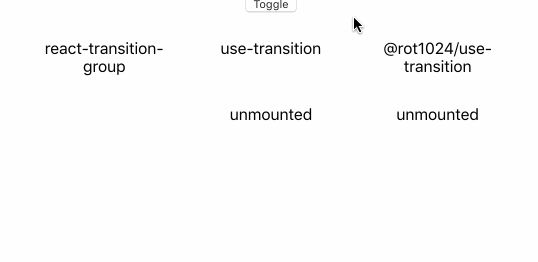

# @rot1024/use-transition

React Hooks for transition animation like Transition component in [react-transition-group](https://github.com/reactjs/react-transition-group), but improves smooth transition

Transition component in react-transition-group, and [use-transition](https://www.npmjs.com/package/use-transition) are very nice. But they are incompatible with [styled-components](https://www.styled-components.com/) or [Emotion](https://emotion.sh/docs/introduction), particularly with `mountOnEnter` or `unmountOnExit`. 

In addition, react-transition-group and use-transition have incorrect transition duration when the transition direction is changed during the transition.

This library improves their problems. Following image is comparision of the libraries.



## Usage

```sh
npm install --dev @rot1024/use-transition
# or
yarn add @rot1024/use-transition
```

```jsx
import { useState } from "react";
import { styled } from "styled-components";
import useTransition from "@rot1024/use-transition";

const StyledDiv = styled.div`
  transition: ${({ state }) => state === "entering" || state === "exiting" ? "all 1s ease" : ""};
  opacity: ${({ state }) => state === "entering" || state === "entered" ? 1 : 0};
`;

const Component = () => {
  const [isActive, setActive] = useState(false);
  const state = useTransition(isActive, 1000, {
    mountOnEnter: true,
    unmountOnExit: true
  });
  // state is "entering", "entered", "exiting", "exited", or "unmounted"

  const handleClick = useCallback(() => {
    setActive(active => !active);
  }, [isActive, setActive])

  return (
    <div>
      <button onClick={handleClick}>Toggle</button>
      {state === "unmounted" ? null : <StyledDiv state={state}>Transition</StyledDiv>}
    </div>
  );
};
```

## License

MIT License
